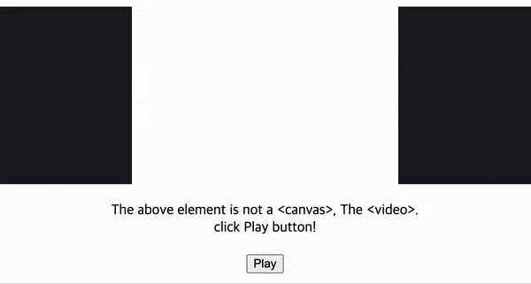

# `@philip21/canvas-video`

- snapshots of the canvas can be exported as video to fit the frame



## Getting Started

```js
import CanvasVideo from '@philip21/canvas-video';

const TEN_MINUTES = 1000 * 60 * 10;
const canvasWidth = 300;
const canvasHeight = 200;
const canvasVideo = new CanvasVideo({
  totalTime: TEN_MINUTES,
  frameRate: 60,
  width: canvasWidth,
  height: canvasHeight,
  className: '_video',
  render: (ctx, { sequence }) => {
    ctx.setTransform(1, 0, 0, 1, 0, 0);
    ctx.clearRect(0, 0, canvasWidth, canvasHeight);

    ctx.translate(canvasWidth / 2, canvasHeight / 2);
    ctx.rotate(0.04 * sequence);
    ctx.translate(0, 0);
    ctx.fillStyle = '#000000';
    ctx.fillRect(-50, -50, 100, 100);
  },
});

canvasVideo.insertUnder(document.body);
```
