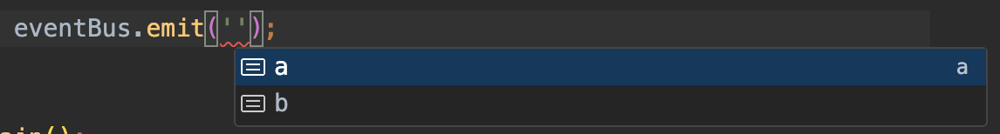
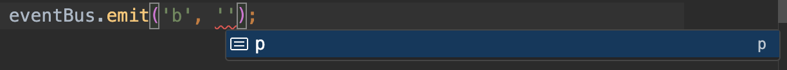

# `@philip21/eventbus`

- universal and light(1kb) event bus module
- no dependencies
- typescript type inference supports.
- simple and light implementation
    - [source](./src/EventBus.ts)

## Installation

```sh
npm install @philip21/eventbus --save
```

## Getting Started

```ts
import EventBus from '@philip21/eventbus';

const eventBus = new EventBus();

eventBus.on('a', console.log);
eventBus.on({
  b: console.log,
  c: console.log,
});

eventBus.emit('a', 2);
eventBus.emit('b', 'p');
eventBus.emit('c', { n: 1 });
```

## Type Inference Support

```ts
interface EventDefinition {
  a: 1 | 2 | 3;
  b: 'p';
}

const eventBus = new EventBus<EventDefinition>().on({
  a: console.log,
  b: console.log,
});

/**
 * or
 *
 * new EventBus<{
 *   a: 1 | 2 | 3;
 *   b: 'p';
 * }>();
 */
```





## Specifications

- [spec code](./src/EventBus.spec.ts)
- `.on(eventName, eventHandler, life?)`
- `.on(eventSpecification)`
- `.once(eventName, eventHandler)`
- `.once(eventSpecification)`
- `.off()`
- `.off(eventName)`
- `.off(eventName, eventHandler)`
- `.has()`
- `.has(eventName)`
- `.has(eventName, eventHandler)`
- `.emit(eventName, eventPayload?)`
